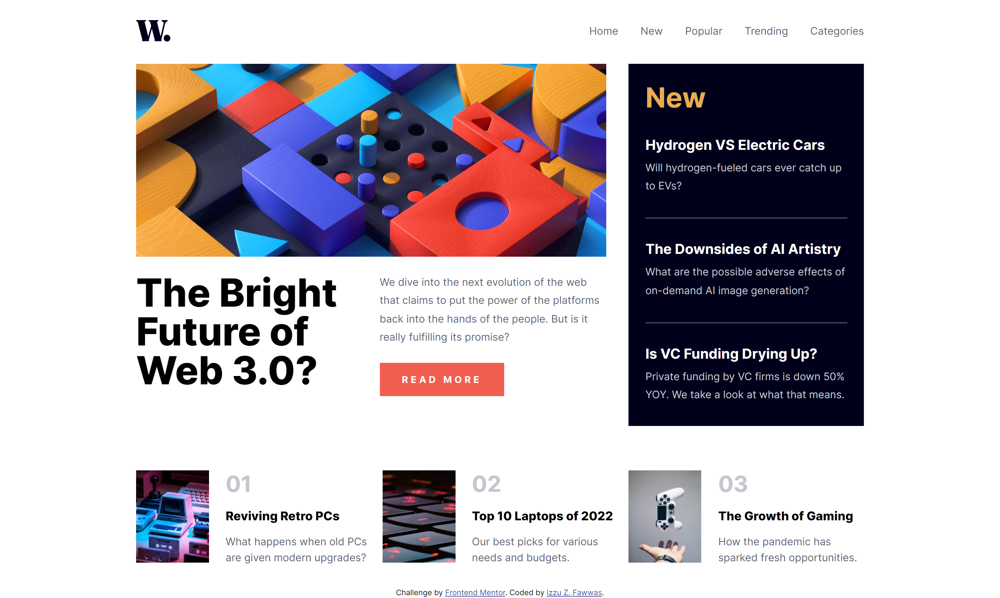

# Frontend Mentor - News homepage solution

This is a solution to the [News homepage challenge on Frontend Mentor](https://www.frontendmentor.io/challenges/news-homepage-H6SWTa1MFl). Frontend Mentor challenges help you improve your coding skills by building realistic projects. 

## Table of contents

- [Frontend Mentor - News homepage solution](#frontend-mentor---news-homepage-solution)
  - [Table of contents](#table-of-contents)
  - [Overview](#overview)
    - [The challenge](#the-challenge)
    - [Screenshot](#screenshot)
    - [Links](#links)
  - [My process](#my-process)
    - [Built with](#built-with)
    - [What I learned](#what-i-learned)
  - [Author](#author)

## Overview

### The challenge

Users should be able to:

- View the optimal layout for the interface depending on their device's screen size
- See hover and focus states for all interactive elements on the page
- **Bonus**: Toggle the mobile menu (requires some JavaScript)

### Screenshot



### Links

- Solution URL: [https://github.com/izzuzantyaf/news-homepage](https://github.com/izzuzantyaf/news-homepage)
- Live Site URL: [https://izzuzantyaf.github.io/news-homepage](https://izzuzantyaf.github.io/news-homepage)

## My process

### Built with

- Semantic HTML5 markup
- CSS custom properties
- Flexbox
- CSS Grid
- Mobile-first workflow

### What I learned

```css
.sidebar-overlay {
  position: fixed;
  top: 0;
  right: 0;
  bottom: 0;
  left: 0;
  background-color: rgba(0, 0, 0, 0.5);
  z-index: 10;
}

.sidebar {
  background-color: var(--off-white);
  width: 67%;
  max-width: calc(375px * (2 / 3));
  padding: 32px 24px;
  position: absolute;
  right: 0;
  height: 100%;
}

.sidebar img.menu-close-icon {
  position: absolute;
  right: 24px;
}
```

## Author

- Website - [izzuzantyaf.space](https://izzuzantyaf.space)
- Frontend Mentor - [@izzuzantyaf](https://www.frontendmentor.io/profile/izzuzantyaf)
- Twitter - [@izzuzantyaf](https://www.twitter.com/izzuzantyaf)